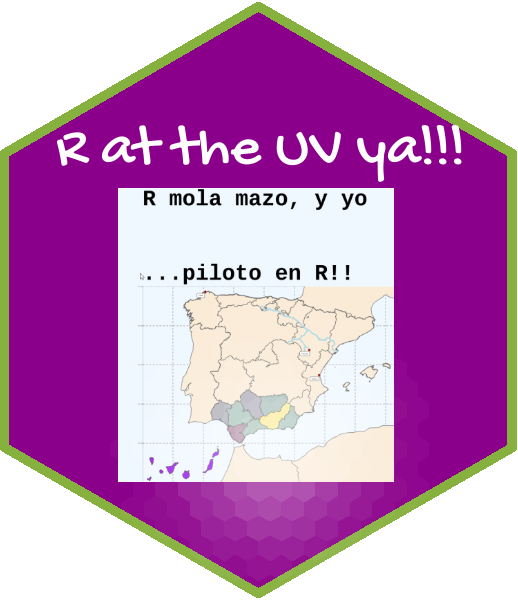

# intro-ds-22-23-web-companion

Repo para dar acceso a los estudiantes del curso **Programación y manejo de datos con R (2022-23)** de la UV a un servicio similar a **foros**. Los "foros" en Github se llaman "Discussions".

Los foros [aquí](https://github.com/perezp44/intro-ds-22-23-web-companion/discussions).

  

Insisto, este repo solo existe para dar acceso a los estudiantes de la asignatura a **foros**. Veremos que tal funcionan!! La página web oficial de la asignatura está [aquí](https://perezp44.github.io/intro-ds-22-23-web/), y el repo que la construye, está [aquí](https://github.com/perezp44/intro-ds-22-23-web). 

-- Pedro J. Pérez
